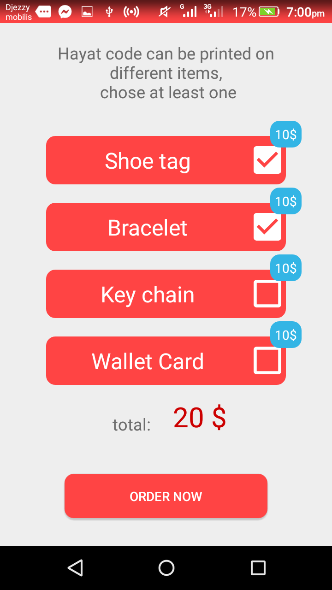
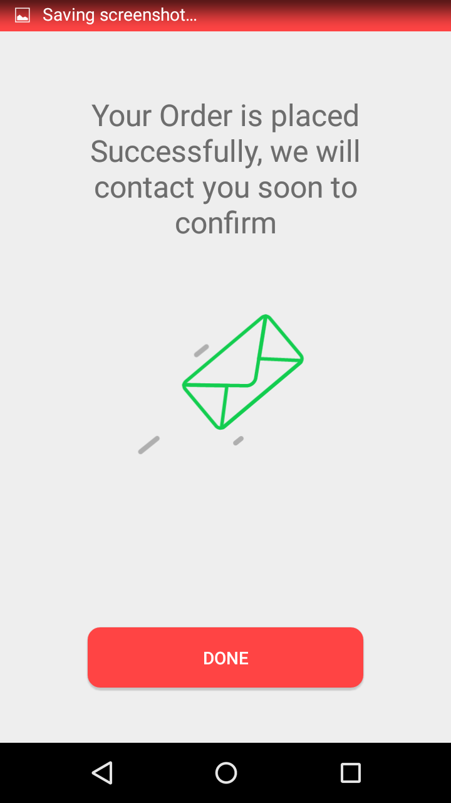
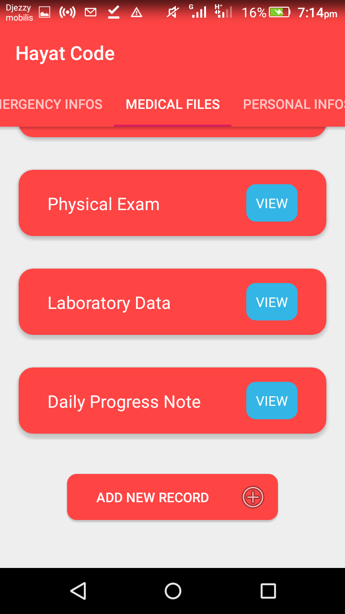
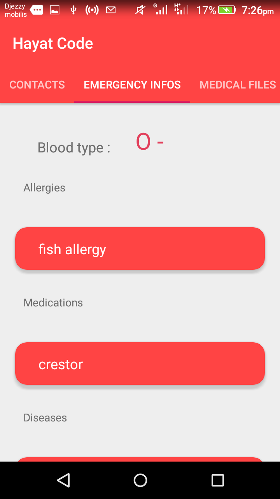
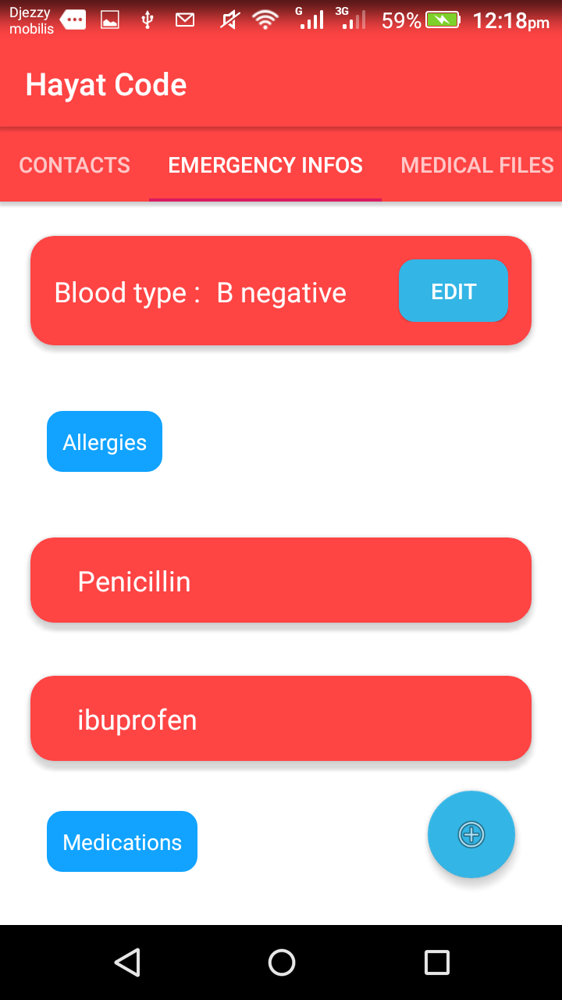
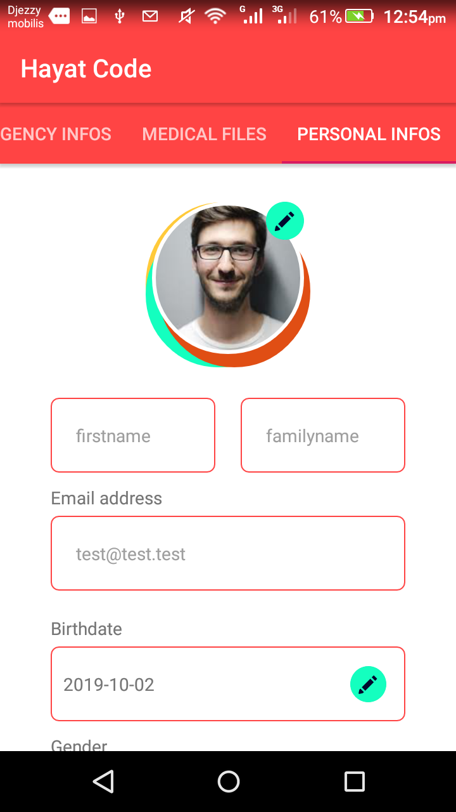
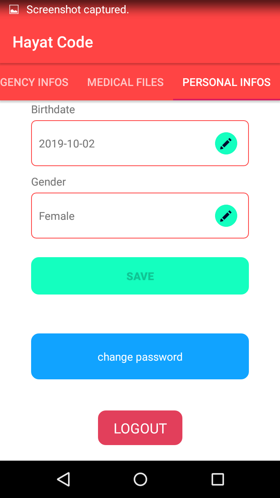

# hayatcode_android
Hayat Code Android Application

Play Store link:
https://play.google.com/store/apps/details?id=com.hayatcode.client

-------------------------------------------------------------
testing information :

Password: testpassword

QR code to scan:

https://firebasestorage.googleapis.com/v0/b/hayatcode-16825.appspot.com/o/qrcode%2FtTKTKtiHDEUKdNZXdSiM5BA8tms2.jpg?alt=media&token=6e99f628-c641-4e8c-b682-ed43dc6e40c5

 
 

